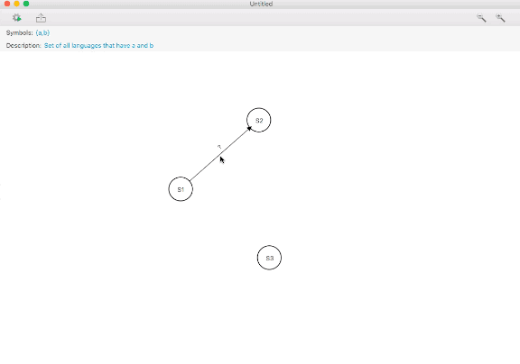

# DFA Doer

State machines play a crucial role in the discussion of Computational Theory. As a visual representation of a mental model, they help in quickly clarifying the inner workings of a state based algorithm. “DFA Doer” is a GUI based pedagogical tool made in JavaFX. As an academic tool, it allows users to quickly design Discrete Finite State Machines and then test it on a given string. By testing a string, the system plays a transitioning animation and highlights the terminal state in red or green depending on whether it is final or not.

States are created by double clicking anywhere in the workspace. By holding shift and dragging towards another state, an empty transition is created. Double clicking a transition allows editing its symbols.  If the states are moved (by dragging), their connected transition arrows reactively follow along.  The panel at the bottom allows testing strings on the current DFA. It contains all the needful controls to step through each symbol of the input. While testing a DFA, editing is disabled.

States and transitions in the application can also be selected by either clicking on them or dragging a selection box around them. Selected states and transitions can then also be moved together or deleted.

Every operation in the application is undoable and redoable to multiple steps. The application also allows saving the document to an external JSON file from where it can be reloaded later. There are also hotkeys defined for several common tasks.

### Aspect oriented programming
At its core, the application follows a clean Model View Controller approach. Several cross cutting concerns are handled in aspects which allow for a more modular codebase and better separation of concerns. Some of these include:

*	Undo Redo (using command pattern)
*	Disabling mouse events during string testing
*	Observer notification while moving states
*	Performance tracking (using annotation)

### Instructions
This is an IntelliJ ultimate project and relies on the configuration of aspectj1.8 lib dependency that may exist in a
different location on the hosts computer.

I used [these steps](http://tzachsolomon.blogspot.com/2015/08/how-to-create-hello-world-with-intellij.html) to setup aspects in the project:

If you still face any issues, please let me know
